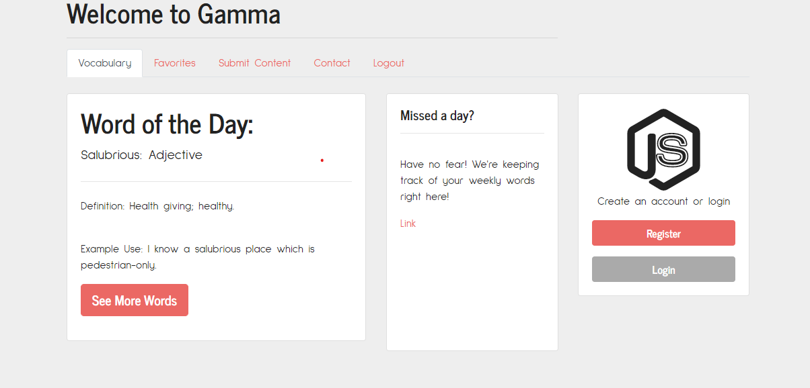
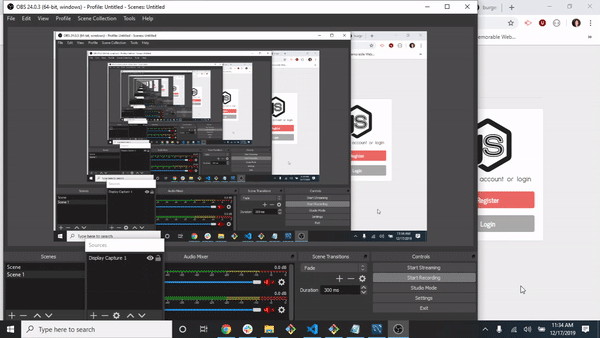

# Gamma - a word of the day application 

## Functionality: 

Gamma will help you expand your vocabulary, save your favorites, and eventually... test those those newfound words!

## Technologies: 

NODE.js, Express, Handlebars, passport.js, sessions, sequelize, mysql, CRON, nodeMailer, EmailJS, bootstrap, bootswatch, HTML 5, CSS 

## Heroku Link: 
* Repo: [Git hub Repo](https://github.com/lmd808/gamma).
* Deployed Heroku App[Heroku App](https://desolate-eyrie-68120.herokuapp.com/).

# HomePage and Quick Site Demo:  

;
;

## Creator: 
Laura DiTommaso
